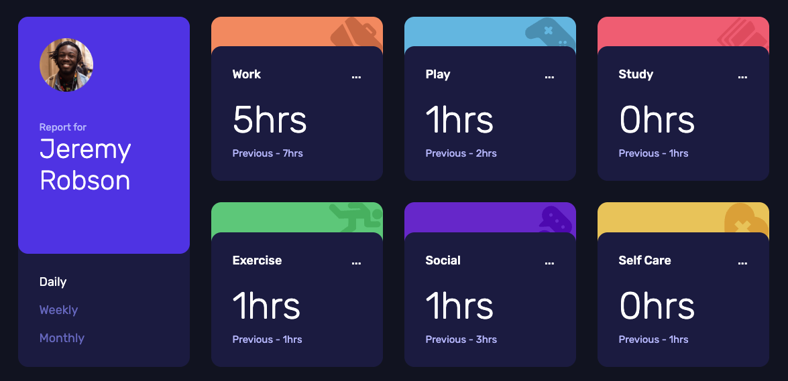
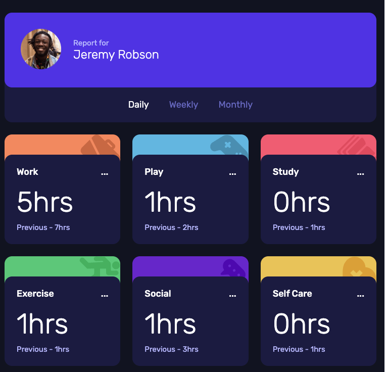
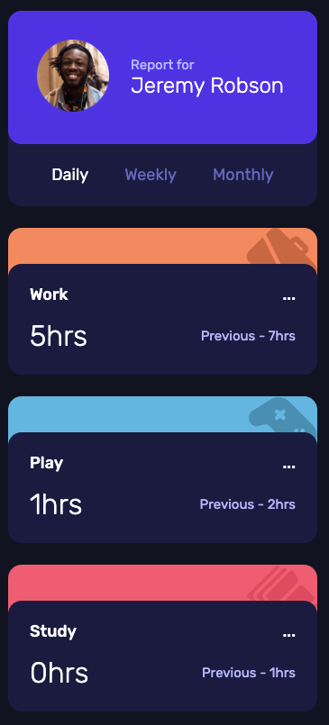

# Frontend Mentor - Time tracking dashboard solution

This is a solution to the [Time tracking dashboard challenge on Frontend Mentor](https://www.frontendmentor.io/challenges/time-tracking-dashboard-UIQ7167Jw). Frontend Mentor challenges help you improve your coding skills by building realistic projects. 

## Table of contents

- [Overview](#overview)
  - [The challenge](#the-challenge)
  - [Screenshot](#screenshot)
  - [Links](#links)
- [My process](#my-process)
  - [Built with](#built-with)
  - [What I learned](#what-i-learned)
  - [Continued development](#continued-development)
- [Author](#author)

## Overview

### The challenge

Users should be able to:

- View the optimal layout for the site depending on their device's screen size
- See hover states for all interactive elements on the page
- Switch between viewing Daily, Weekly, and Monthly stats

### Screenshot

 //Not the whole length

### Links

- Solution URL: [https://github.com/majdal01/time-tracking-dashboard.git]
- Live Site URL: [https://majdal01.github.io/time-tracking-dashboard/]

## My process

### Built with

- Semantic HTML5 markup
- SASS
- Flexbox
- CSS Grid
- JavaScript

### What I learned

This was a very nice exercise in DRY coding. I started out with an eventlistener on each button, and with a little help from copilot, I boiled it down to reusing a code for each event 

### Continued development

JavaScript. I am not yet there, that I can write JavaScript without help. But I really want to. 

Overall I love these challenges from Frontendmentor. It gives me challenges on all aspects, and that is the only way to learn.

## Author

- Frontend Mentor - [@majdal01](https://www.frontendmentor.io/profile/majdal01)

